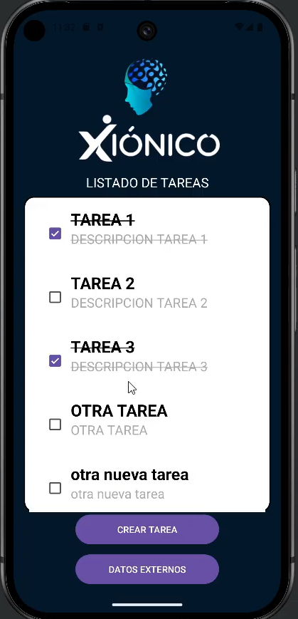
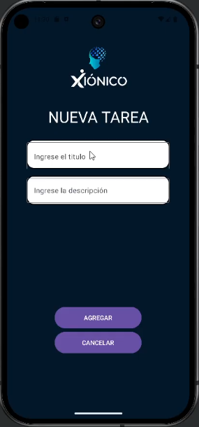
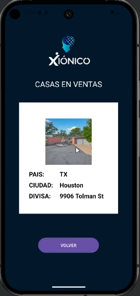

# Challenge XIONICO

App development in Android Studio

### Technologies:

* Android Studio
* Java language
* Kotlin DSL
* Docker desktop
* Microsoft SQL Server database
* Python
* Django ninja framework

### Screens

#### Main:

#### New Tasks:

#### Houses:

### Video explained:

